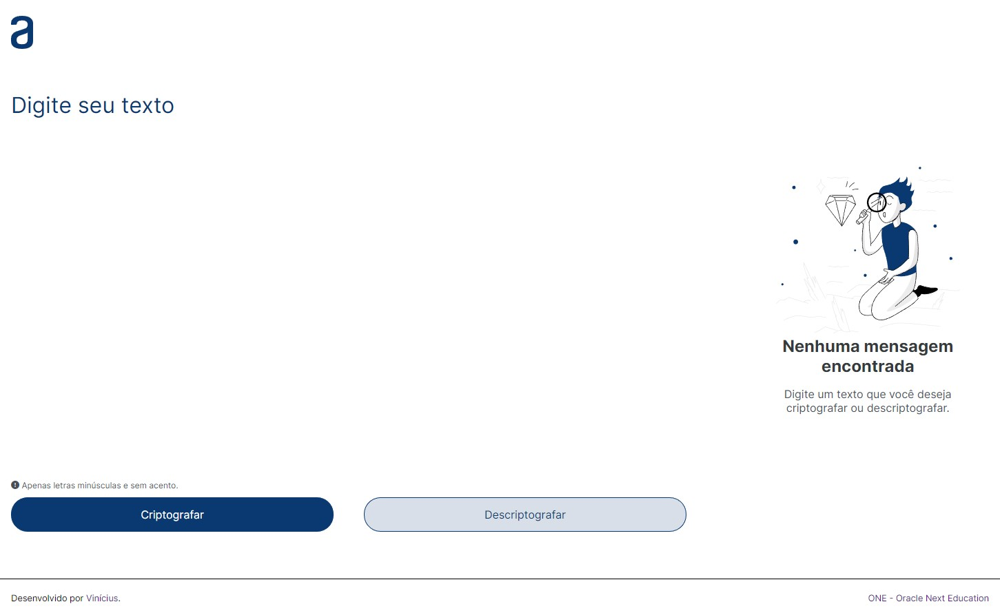
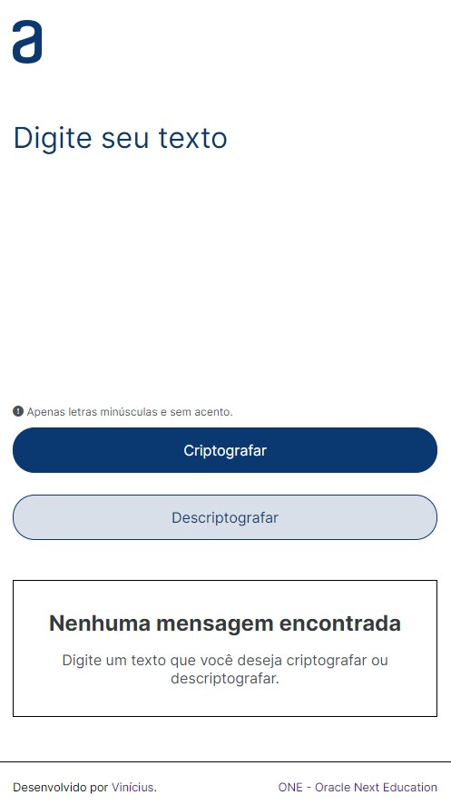

# Primeiro Challenge do One - Oracle Next Education

O desafio consiste em desenvolver uma aplicação para decodificar textos, a página possui responsividade e vária de acordo com a resolução para celular, tablet e desktop.

## Requisitos
- Deve funcionar apenas com letras minúsculas.
- Não devem ser utilizados letras com acentos nem caracteres especiais.
- Deve ser possível converter uma palavra para a versão criptografada e também retornar uma palavra criptografada para a versão original.
- A página deve ter campos para inserção do texto a ser criptografado ou descriptografado, e a pessoa usuária deve poder escolher entre as duas opções
- O resultado deve ser exibido na tela.
- Um botão que copie o texto criptografado/descriptografado para a área de transferência.

## Funcionamento

As vogais do texto serão convertidas em uma sequência de letras pré determinadas.

- A letra "e" é convertida para "enter".
- A letra "i" é convertida para "imes".
- A letra "a" é convertida para "ai".
- A letra "o" é convertida para "ober".
- A letra "u" é convertida para "ufat".

**Página desktop**

**Página mobile**
 

## Linguagens

HTML5 | CSS3 | JavaScript

## Ferramentas

Figma | Trello | Visual Studio Code
